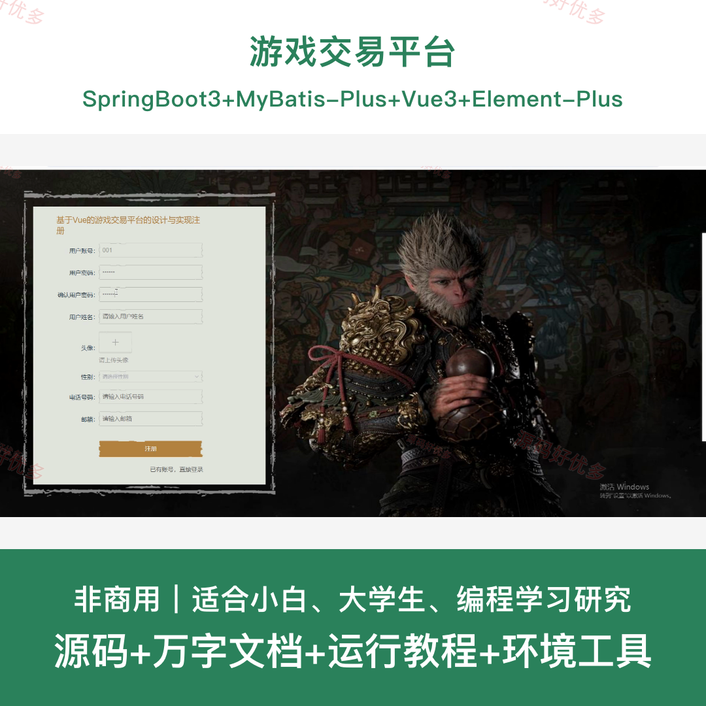
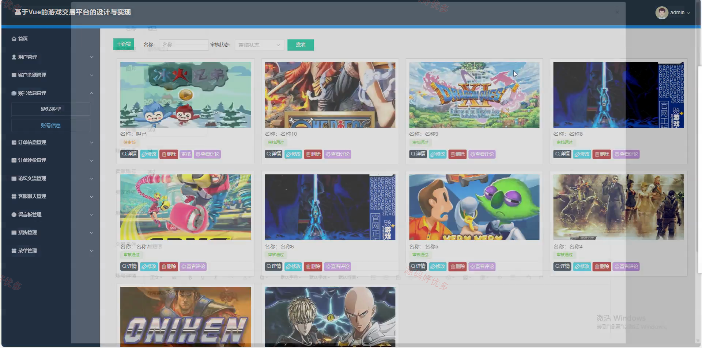
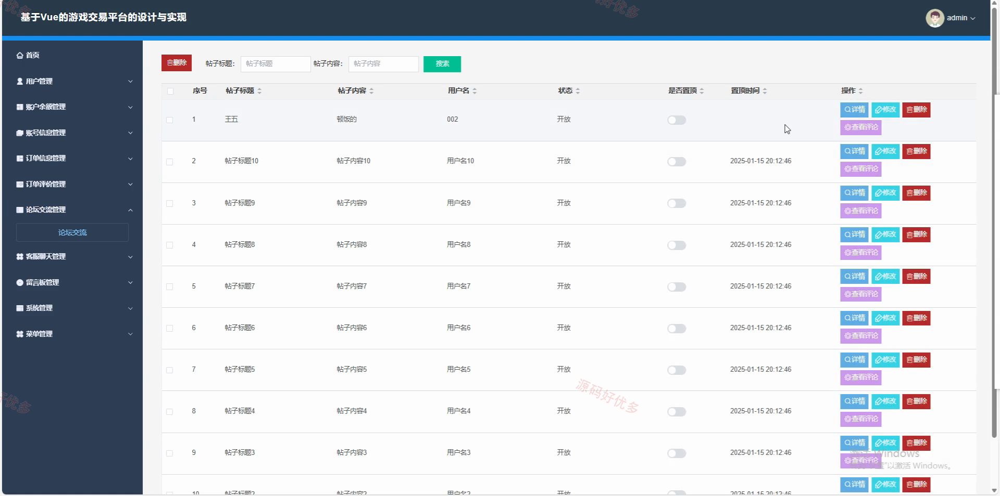
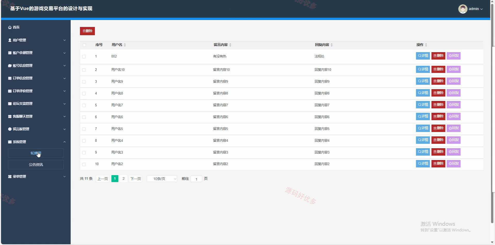
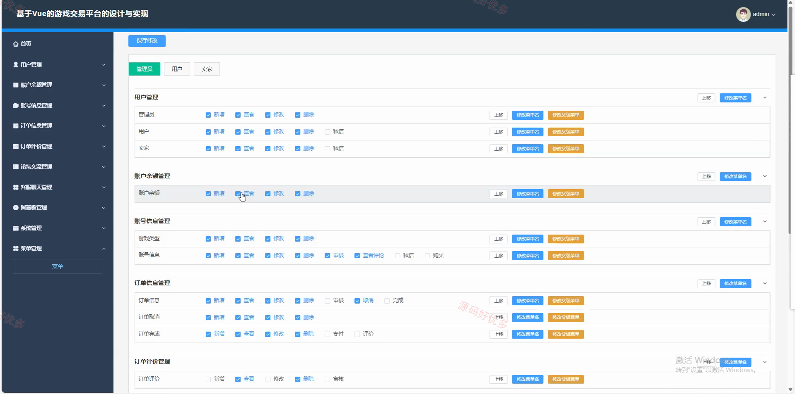
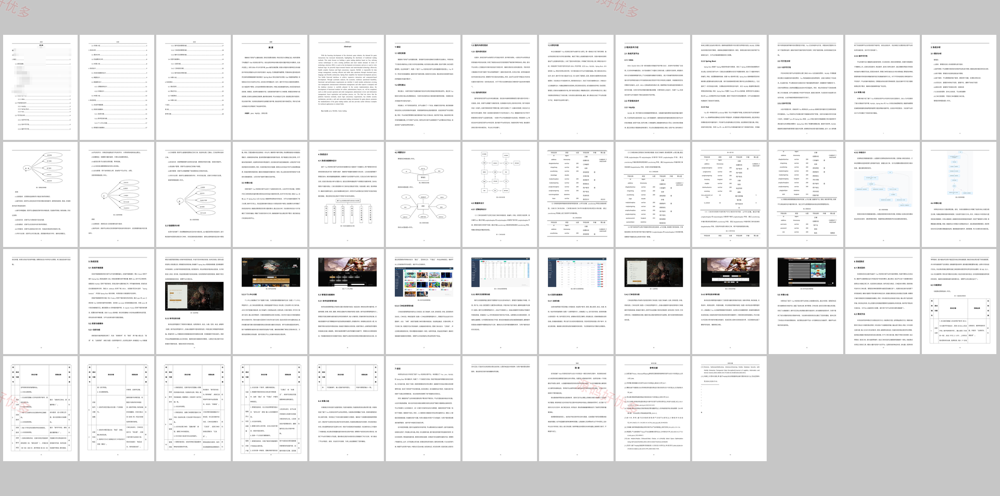

# springbootA572D
springbootA572D游戏交易平台
## 源码问题查看主页咨询

### 一、关键词
游戏交易平台、游戏账号交易、卖家发布账号、订单交易管理、论坛交流

### 二、作品包含
源码+数据库+万字设计文档+全套环境和工具资源+本地部署教程

### 三、项目技术
前端技术： Html、Css、Js、Vue3.2、Element-Plus
后端技术：Java、SpringBoot3.3.0、MyBatis-Plus

### 四、运行环境（以下版本亲测，其他版本兼容性请自行测试）
开发工具：IDEA/eclipse + VSCODE

数据库：MySQL5.7+（共21张表）

数据库管理工具：Navicat10以上版本

环境配置软件： JDK1.8 + Maven3.6.3

前端Nodejs：16+

浏览器：谷歌浏览器

### 五、项目介绍
项目编号：springbootA572D

游戏交易平台面向游戏账号线上交易场景，提供游戏类型、账号信息发布、收藏、下单、订单完成、订单取消、订单评价、账户余额、论坛交流和消息沟通等功能，用户可以浏览并购买账号，卖家可以发布账号并处理交易，管理员负责平台内容和订单监管。

角色：用户、卖家、管理员

用户功能：用户注册登录、游戏账号浏览、账号收藏、在线下单、订单支付、订单评价、论坛交流、消息沟通、个人余额查看；卖家登录、账号信息发布、交易订单处理、订单完成确认。

管理员功能：用户管理、卖家管理、游戏类型管理、账号信息管理、订单信息管理、订单取消管理、订单完成管理、论坛管理、资讯管理、系统配置管理。

### 六、运行截图

